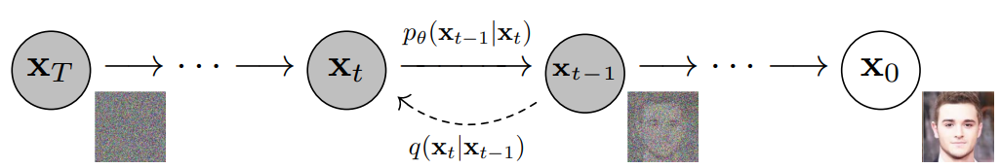
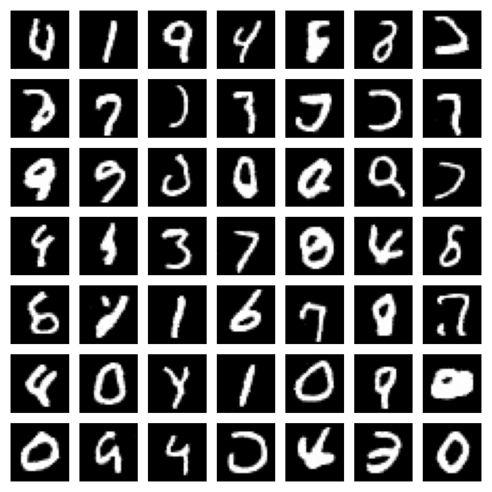

# Discrete-Time Diffusion Models for Discrete Data

[](https://github.com/paulffm/Discrete-Time-Diffusion-Models-for-Continuous-Data/blob/main/LICENSE)

Unofficial **PyTorch** reimplementations of the
papers [Denoising Diffusion Probabilistic Models](https://arxiv.org/pdf/2006.11239)
by J. Ho et al. and [Improved Denoising Diffusion Probabilistic Models](https://arxiv.org/pdf/2102.09672)
by A. Nichol et al., both with [Classifier-Free Diffusion Guidance](https://openreview.net/pdf?id=qw8AKxfYbI)

<p align="center">
  
</p>

## Installation

Follow these steps to clone the repository and install the dependencies:

### 1. Clone the repository

Clone the repository using the following command:

```sh
git clone https://github.com/paulffm/Discrete-Time-Diffusion-Models-for-Continuous-Data.git
cd Discrete-Time-Diffusion-Models-for-Continuous-Data
```

### 2. Create a virtual environment

Create a virtual environment to install dependencies in isolation:

```sh
python -m venv myvenv
source myvenv/bin/activate  # On Windows use `myvenv\Scripts\activate`
```

### 3. Install dependencies

Install the necessary dependencies using pip:

```sh
pip install -r requirements.txt
```

## Usage

This implementation provides example notebooks for training and retraining the models from the papers to generate MNIST data. The following notebooks are available:

- **`experiment_continuous.ipynb`**: Notebook for training and sampling the model.
- **`experiment_use_saved_models.ipynb`**: Notebook for retraining and sampling an existing model.

Run these notebooks to train, retrain, and generate MNIST data.

Additionally, a configuration file is provided in this repository, which allows you to set various parameters for the training and model settings. The parameters and their descriptions are as follows:

| Parameter                | Description                                                        | Type    |
| ------------------------ | ------------------------------------------------------------------ | ------- |
| data.batch_size          | Batch size used for training                                       | int     |
| data.dataset             | Name of the dataset                                                | str     |
| data.image_size          | Size of the input images                                            | int     |
| data.use_augmentation    | Whether to use data augmentation                                   | bool    |
| diffusion.beta_schedule  | Schedule type for beta values                                      | str     |
| diffusion.image_size     | Size of the diffusion images                                       | int     |
| diffusion.in_channels    | Number of input channels                                           | int     |
| diffusion.loss_type      | Type of loss function                                              | str     |
| diffusion.timesteps      | Number of timesteps for diffusion process                          | int     |
| model.channels           | Number of channels in the model                                    | int     |
| model.class_embed_dim    | Dimension of class embeddings                                      | int     |
| model.dim                | Base dimension of the model                                        | int     |
| model.dim_mults          | Multipliers for model dimensions at different stages               | list[int]|
| model.init_dim           | Initial dimension (set to null, treated as int)                    | int     |
| model.learned_sinusoidal_dim | Dimension for learned sinusoidal embeddings                      | int     |
| model.num_classes        | Number of classes (set to null, treated as int)                    | int     |
| model.out_dim            | Output dimension (set to null, treated as int)                     | int     |
| model.resnet_block_groups| Number of groups in ResNet blocks                                  | int     |
| model.self_condition     | Whether to use self-conditioning                                   | bool    |
| model.use_bits           | Whether to use bit representations                                 | bool    |
| model.use_learned_var    | Whether to use learned variance                                    | bool    |
| model.use_sinposemb      | Whether to use sinusoidal position embeddings                      | bool    |
| optimizer.lr             | Learning rate for the optimizer                                    | float   |
| optimizer.optimizer      | Optimizer type                                                     | str     |
| trainer.batch_size       | Batch size used for training                                       | int     |
| trainer.cond_weight      | Conditional weight for training                                    | float   |
| trainer.device           | Device to be used for training                                     | str     |
| trainer.image_size       | Size of the input images                                            | int     |
| trainer.loss_show_epoch  | Frequency (in epochs) of showing loss                              | int     |
| trainer.model_name       | Name used for saving the model checkpoint                          | str     |
| trainer.nb_epochs        | Number of epochs for training                                      | int     |
| trainer.sample_epoch     | Frequency (in epochs) of sampling                                  | int     |
| trainer.save_epoch       | Frequency (in epochs) of saving the model checkpoint               | int     |
| trainer.use_cfg          | Whether to use configuration                                        | bool    |
| trainer.use_ema          | Whether to use Exponential Moving Average (EMA)                    | bool    |

## Results
DDPM results on MNIST: FID: 2.32; Inception Score: 8.6

<p align="center">
  
</p>

## Reference

```bibtex
@article{ho2020denoising,
  title={Denoising diffusion probabilistic models},
  author={Ho, Jonathan and Jain, Ajay and Abbeel, Pieter},
  journal={Advances in neural information processing systems},
  volume={33},
  pages={6840--6851},
  year={2020}
}
@inproceedings{nichol2021improved,
  title={Improved denoising diffusion probabilistic models},
  author={Nichol, Alexander Quinn and Dhariwal, Prafulla},
  booktitle={International conference on machine learning},
  pages={8162--8171},
  year={2021},
  organization={PMLR}
}
@article{ho2022classifier,
  title={Classifier-free diffusion guidance},
  author={Ho, Jonathan and Salimans, Tim},
  journal={arXiv preprint arXiv:2207.12598},
  year={2022}
}
```
