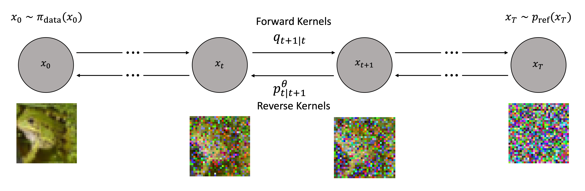

# Discrete-Time Diffusion Models for Discrete Data

[](https://github.com/paulffm/Discrete-Time-Diffusion-Models-for-Continuous-Data/blob/main/LICENSE)

Unofficial **PyTorch** reimplementations of the
papers [Denoising Diffusion Probabilistic Models](https://arxiv.org/pdf/2006.11239)
by J. Ho et al. and [Improved Denoising Diffusion Probabilistic Models](https://arxiv.org/pdf/2102.09672)
by A. Nichol et al., both with [Classifier-Free Diffusion Guidance](https://openreview.net/pdf?id=qw8AKxfYbI)

<p align="center">
  
</p>


## Usage

This implementation provides example notebooks for training/retraining the models from the papers to generate MNIST data.

## Results
D3PM Results on MNIST: FID = 1.88; Inception Score = 8.6

<p align="center">
  
</p>

## Reference

```bibtex
@article{ho2020denoising,
  title={Denoising diffusion probabilistic models},
  author={Ho, Jonathan and Jain, Ajay and Abbeel, Pieter},
  journal={Advances in neural information processing systems},
  volume={33},
  pages={6840--6851},
  year={2020}
}
@inproceedings{nichol2021improved,
  title={Improved denoising diffusion probabilistic models},
  author={Nichol, Alexander Quinn and Dhariwal, Prafulla},
  booktitle={International conference on machine learning},
  pages={8162--8171},
  year={2021},
  organization={PMLR}
}
@article{ho2022classifier,
  title={Classifier-free diffusion guidance},
  author={Ho, Jonathan and Salimans, Tim},
  journal={arXiv preprint arXiv:2207.12598},
  year={2022}
}
```
